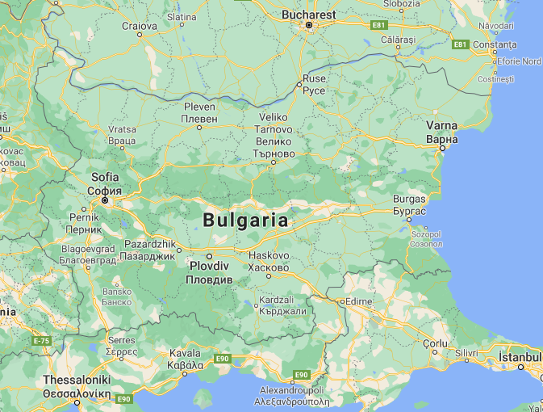
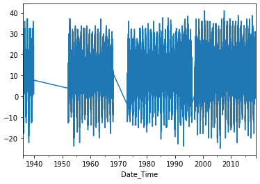
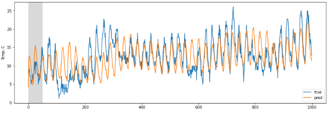
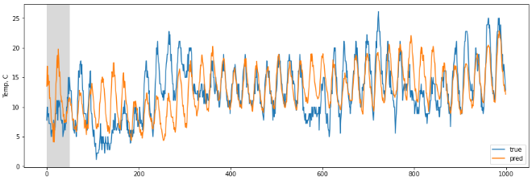
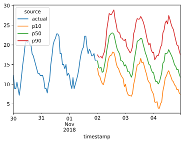

## Machine Learning Engineer Nanodegree
## Udacity


# Capstone Project
# Report


## Ognian Dantchev
## August 6th, 2021


## Table of Contents

1. [Definition](#1-definition)

2. [Analysis](#2-analysis)

3. [Methodology](#3-methodology)

4. [Results](#4-results)

5. [Conclusion](#5-conclusion)

6. [References](#6-references)


## 1. Definition

### Project Overview

Time series forecasting is applied when scientific predictions are needed based on historical data with time component.  Time series forecasting has many applications in various industries.  Companies  use everything from simple spreadsheets to complex financial planning software in an attempt to accurately forecast future business outcomes such as product demand, resource needs, crops yield, traffic or financial performance.  Beyond business, applications include healthcare, medical, environmental studies, social studies and other forecasting.

There are many classical time series forecasting methods, based on autoregressive (AR) models, exponential smoothing, Fourier Transform, etc.

Models based on Neural Networks are able to handle more complex nonlinear patterns.  They have less restrictions and make less assumptions; have high predictive power and can be easily automated.  Their cons -- they require more data; can be more difficult to interpret, and, it is more difficult to derive confidence intervals for the forecast.   

In this project, three different Neural Networks were implemented for time series forecasting.  A Recurrent Neural Network (RNN) with Gated Recurrent Unit (GRU) from the Keras API, as described in the TensorFlow Tutorials in [ [1](#6-references) ].  Second is a Dilated Causal CNN, I implemented in the past in [ [2](#6-references) ] and as originally described in [ [6](#6-references) ] by Aaron van den Oord, Sander Dieleman et al.  Both 1st and 2nd models use Keras and TensorFlow 2.5.  The third model implemented is based on the DeepAR+ algorithm of Amazon Forecast by AWS.


### Problem Statement

The purpose of this project is to implement model based on the DeepAR+ algorithm by Amazon and deploy it to AWS.  As a secondary target, I try to compare the results to other NN models for time series.  Own dataset with 45 years of local meteorology data was used, but no meteorology domain claims whatsoever.

The implementation was split into 5 smaller Jupyter Notebooks:

01. Generate and download the raw dataset at https://www.ncdc.noaa.gov/ .  Data import and exploration;  Changing some of the labels using the Inventory file.  Data cleaning and pre-processing;  Feature engineering and data transformation -- add day-of-year (between 1 and 366) and the hour-of-day (between 0 and 23);  Save the clean data in compact new format for use in next notebooks.

02. Split the data into training, validation, and testing sets;  Define and train a Gated Recurrent Unit (GRU) RNN Model.

03. Split the data into training, validation, and testing sets; Define and train a Dilated Causal CNN Model. (model and model2 are the same, but use different way of building with Keras functional API -- as an experiment).

04. Connect AWS API session, create IAM role for Amazon Forecast, create S3 bucket; upload the dataset to AWS S3 bucket;  Define and train a model from AWS Amazon Forecast -- Amazon DeepAR+ algorithm.  I diviated from the original plan to use the open source Gluon Time Series (GluonTS) toolkit by AWS Labs, in favor of the Amazon DeepAR+ algorithm, as it is state-of-the-art and used by amazon.com; Deployed the later model to AWS.

05. Discussion, TODO, Cleanup of AWS resources and References.  Evaluate and compare the models, to the extend possible.


### Metrics


Common merics for Time Series Analysis are Mean Absolute Error (MAE), Mean Squared Error (MSE), Mean Absolute Percentage Error (MAPE),  Weighted Average Percentage Error (WAPE, also referred to as the MAD/Mean ratio.

$MSE=\sum_{j=0}^{n} (y_i - \hat{y_i})$

Mean Squared Error (MSE) will be used as the loss-function that will be minimized and used as a metric. This measures how closely the model's output matches the true output signals.

At the beginning of a sequence, the model has only seen input-signals for a few time-steps, so its generated output may be very inaccurate.  Therefore the model will be given a "warmup-period" of 50 time-steps where we don't use its accuracy in the loss-function, in hope of improving the accuracy for later time-steps, see [ [1](#6-references) ]

Amazon Forecast DeepAR+ uses RMSE and and WAPE metrics, [RMSD Wikipedia article](https://en.wikipedia.org/wiki/Root-mean-square_deviation)

I'm using this relation to comapre the metrics for the Dilated Causal CNN and the Amazon DeepAR+ model:
$RMSE=\sqrt{MSE}$


The re-sampled data will be used to create "future" period by shifting the target-data. 
---


## 2. Analysis

### Data Exploration

### Algorithms and APIs

Recurrent neural networks (RNN) are a class of neural networks that is powerful for modeling sequence data such as time series or natural language.  The 1st model will be based RNN with Gated Recurrent Unit (GRU).  The 2nd one, I used in the past in [ [2](#6-references) ], will be based on Dilated Causal CNN, often used for audio processing [ [6](#6-references) ].

Here's a typical diagram of RNNs (from Stanford CS 230):


Here's a diagram of a Dilated Causal CNN, from the original WaveNet article [ [6](#6-references) ]:


## 3. Methodology


### Data Preprocessing

Weather data for the period 1936-2018 will be used for four cities in Bulgaria -- Ruse, Sofia, Varna and Veliko Tarnovo.  After struggling with the format of some of the local sources, I found that the National Centers for Environmental Information of the National Oceanic and Atmospheric Administration https://www.ncei.noaa.gov/ provide an access to a global source of climatic data.  It was also used in [ [1](#6-references)], and one can pick almost any location in the world.  



Since weather data is most diligently collected at airports, cities are encoded with their USAF codes.  A function to convert these codes to names was prepared, as well as one that converts deg F to deg C.  



There are some gaps in the data, so I removed some period, and at the end I only use 1973 to 2018 -- i.e. 45 years of data vs the original 82 years, but still more than enough.  Removed 2 of the cities with bigger gaps, so only Sofia and Varna time series left in the clean dataset.  After that, the series were re-sampled, so an hourly frequency can be used for the entire period (data was colleted only 2 times a day in the 1930ies, then 3 times, then 6, and currenlty more than 24 times).  

Here's the sequence to acquire, clean and reshape the data:
* generate the raw data set at https://www.ncdc.noaa.gov/ (https://www7.ncdc.noaa.gov/CDO/cdoselect.cmd -- the old data request form)
* review the original dataset files
* resample data and helper functions
* remove data (where gaps are too big)
* add data (linearly interpolated from the neighboring values)
* save the clean, resampled data to a binary file.

This was done in Jupyter notebook 01, and then the clean data was saved in Python standard binary file format. 

The raw dataset was uploaded in ZIP to GitHub, for review, at the project proposal stage: 
https://github.com/ogniandantchev/ML_engineer_nd009_capstone 


### Implementation

The Keras API and TensorFlow 2.5 was used to create the first 2 models, notebooks 02 and 03.

#### Gated Recurrent Unit (GRU) RNN Model Implementation

```
model = Sequential()
model.add(GRU(units=512,
              return_sequences=True,
              input_shape=(None, num_x_signals,)))
model.add(Dense(num_y_signals, activation="tanh")) 
```

Loss function calculates MSE, but after ignoring some "warmup" part of the sequences:

`warmup_steps = 50`

Later on these are visualized in gray in the Forecast plots.

```
model.summary()

Model: "sequential"
_________________________________________________________________
Layer (type)                 Output Shape              Param #   
=================================================================
gru (GRU)                    (None, None, 512)         798720    
_________________________________________________________________
dense (Dense)                (None, None, 1)           513       
=================================================================
Total params: 799,233
Trainable params: 799,233
Non-trainable params: 0
_________________________
```

#### Dilated Causal CNN Model Implementation


```
# Keras Sequential definition -- var model2

p='causal' 
# this only works in TF 1.12+ -- December 2018+
# 2021: works with TensorFlow 2.5 too

model2 = Sequential([
    
    Conv1D(filters=32, input_shape=( None, num_x_signals ), 
           kernel_size=2, padding='causal', dilation_rate=1),
    Conv1D(filters=32, kernel_size=2, padding=p, dilation_rate=2),
    Conv1D(filters=32, kernel_size=2, padding=p, dilation_rate=4),
    Conv1D(filters=32, kernel_size=2, padding=p, dilation_rate=8),
    Conv1D(filters=32, kernel_size=2, padding=p, dilation_rate=16),
    Conv1D(filters=32, kernel_size=2, padding=p, dilation_rate=32),
    Conv1D(filters=32, kernel_size=2, padding=p, dilation_rate=64),
    Conv1D(filters=32, kernel_size=2, padding=p, dilation_rate=128),
    Dense(128, activation=tf.nn.relu), 
    Dropout(.2),
    Dense(1, activation="tanh")     
])

model2.compile(Adam(), loss='mean_absolute_error')
```

Using Standard MSE as loss here `loss='mean_absolute_error'` .

```

model2.summary()

Model: "sequential_1"
_________________________________________________________________
Layer (type)                 Output Shape              Param #   
=================================================================
conv1d_16 (Conv1D)           (None, None, 32)          416       
_________________________________________________________________
conv1d_17 (Conv1D)           (None, None, 32)          2080      
_________________________________________________________________
conv1d_18 (Conv1D)           (None, None, 32)          2080      
_________________________________________________________________
conv1d_19 (Conv1D)           (None, None, 32)          2080      
_________________________________________________________________
conv1d_20 (Conv1D)           (None, None, 32)          2080      
_________________________________________________________________
conv1d_21 (Conv1D)           (None, None, 32)          2080      
_________________________________________________________________
conv1d_22 (Conv1D)           (None, None, 32)          2080      
_________________________________________________________________
conv1d_23 (Conv1D)           (None, None, 32)          2080      
_________________________________________________________________
dense_4 (Dense)              (None, None, 128)         4224      
_________________________________________________________________
dropout_2 (Dropout)          (None, None, 128)         0         
_________________________________________________________________
dense_5 (Dense)              (None, None, 1)           129       
=================================================================
Total params: 19,329
Trainable params: 19,329
Non-trainable params: 0
```

#### Amazon Forecast model, based on DeepAR+ algorithm


Similarly to the scheme above, most of the work is in preparing the dataset (one time series here) in the Amazon Forecast specific format, copy to the newly created S3 bucket and import to AWS Forecast.  Here's the import result at the end:

```
forecast.describe_dataset_import_job(DatasetImportJobArn=ts_dataset_import_job_arn)


{'DatasetImportJobName': 'sof_temperature_forecast_1',
 'DatasetImportJobArn': 'arn:aws:forecast:eu-central-1:574930355514:dataset-import-job/sof_temperature_forecast_1/sof_temperature_forecast_1',
 'DatasetArn': 'arn:aws:forecast:eu-central-1:574930355514:dataset/sof_temperature_forecast_1',
 'TimestampFormat': 'yyyy-MM-dd hh:mm:ss',
 'UseGeolocationForTimeZone': False,
 'DataSource': {'S3Config': {'Path': 's3://forecast-test-0/t1.csv',
   'RoleArn': 'arn:aws:iam::574930355514:role/ForecastNotebookRole-Basic'}},
 'FieldStatistics': {'item_id': {'Count': 401784,
   'CountDistinct': 1,
   'CountNull': 0,
   'CountLong': 401784,
   'CountDistinctLong': 1,
   'CountNullLong': 0},
  'target_value': {'Count': 401784,
   'CountDistinct': 12756,
   'CountNull': 0,
   'CountNan': 0,
   'Min': '-25.0',
   'Max': '41.11',
   'Avg': 10.1715268852146,
   'Stddev': 9.428677566143127,
   'CountLong': 401784,
   'CountDistinctLong': 12756,
   'CountNullLong': 0,
   'CountNanLong': 0},
  'timestamp': {'Count': 401784,
   'CountDistinct': 401784,
   'CountNull': 0,
   'Min': '1973-01-01T00:00:00Z',
   'Max': '2018-11-01T23:00:00Z',
   'CountLong': 401784,
   'CountDistinctLong': 401784,
   'CountNullLong': 0}},
 'DataSize': 0.012740140780806541,
 'Status': 'ACTIVE',
 'CreationTime': datetime.datetime(2021, 7, 29, 15, 58, 11, 748000, tzinfo=tzlocal()),
 'LastModificationTime': datetime.datetime(2021, 7, 29, 16, 6, 20, 94000, tzinfo=tzlocal()),
 'ResponseMetadata': {'RequestId': 'd73cb6b2-1910-4a59-b0ee-27c2667f66e7',
  'HTTPStatusCode': 200,
  'HTTPHeaders': {'content-type': 'application/x-amz-json-1.1',
   'date': 'Thu, 29 Jul 2021 13:06:35 GMT',
   'x-amzn-requestid': 'd73cb6b2-1910-4a59-b0ee-27c2667f66e7',
   'content-length': '1182',
   'connection': 'keep-alive'},
  'RetryAttempts': 0}}
```

Then creating the model:
```
create_predictor_response = \
    forecast.create_predictor(PredictorName=predictor_name_deep_ar,
                              AlgorithmArn=algorithm_arn_deep_ar_plus,
                              ForecastHorizon=FORECAST_LENGTH,
                              PerformAutoML=False,
                              PerformHPO=False,
                              InputDataConfig= {"DatasetGroupArn": dataset_group_arn},
                              FeaturizationConfig= {"ForecastFrequency": DATASET_FREQUENCY}
                             )
```


```
forecast.describe_predictor(PredictorArn=predictor_arn_deep_ar)

{'PredictorArn': 'arn:aws:forecast:eu-central-1:574930355514:predictor/sof_temperature_forecast_1_deep_ar_plus',
 'PredictorName': 'sof_temperature_forecast_1_deep_ar_plus',
 'AlgorithmArn': 'arn:aws:forecast:::algorithm/Deep_AR_Plus',
 'ForecastHorizon': 72,
 'ForecastTypes': ['0.1', '0.5', '0.9'],
 'PerformAutoML': False,
 'PerformHPO': False,
 'TrainingParameters': {'context_length': '144',
  'epochs': '500',
  'learning_rate': '1E-3',
  'learning_rate_decay': '0.5',
  'likelihood': 'student-t',
  'max_learning_rate_decays': '0',
  'num_averaged_models': '1',
  'num_cells': '40',
  'num_layers': '2',
  'prediction_length': '72'},
 'EvaluationParameters': {'NumberOfBacktestWindows': 1,
  'BackTestWindowOffset': 72},
 'InputDataConfig': {'DatasetGroupArn': 'arn:aws:forecast:eu-central-1:574930355514:dataset-group/sof_temperature_forecast_1'},
 'FeaturizationConfig': {'ForecastFrequency': 'H',
  'Featurizations': [{'AttributeName': 'target_value',
    'FeaturizationPipeline': [{'FeaturizationMethodName': 'filling',
      'FeaturizationMethodParameters': {'aggregation': 'sum',
       'backfill': 'zero',
       'frontfill': 'none',
       'middlefill': 'zero'}}]}]},
 'PredictorExecutionDetails': {'PredictorExecutions': [{'AlgorithmArn': 'arn:aws:forecast:::algorithm/Deep_AR_Plus',
    'TestWindows': [{'TestWindowStart': datetime.datetime(2018, 10, 30, 2, 0, tzinfo=tzlocal()),
      'TestWindowEnd': datetime.datetime(2018, 11, 2, 2, 0, tzinfo=tzlocal()),
      'Status': 'ACTIVE'}]}]},
 'DatasetImportJobArns': ['arn:aws:forecast:eu-central-1:574930355514:dataset-import-job/sof_temperature_forecast_1/sof_temperature_forecast_1'],
 'AutoMLAlgorithmArns': ['arn:aws:forecast:::algorithm/Deep_AR_Plus'],
 'Status': 'ACTIVE',
 'CreationTime': datetime.datetime(2021, 7, 29, 16, 9, 7, 637000, tzinfo=tzlocal()),
 'LastModificationTime': datetime.datetime(2021, 7, 29, 18, 39, 4, 691000, tzinfo=tzlocal()),
 'ResponseMetadata': {'RequestId': 'c7dc6e9e-e288-4c08-8be5-b8e73d73df2e',
  'HTTPStatusCode': 200,
  'HTTPHeaders': {'content-type': 'application/x-amz-json-1.1',
   'date': 'Thu, 29 Jul 2021 18:51:42 GMT',
   'x-amzn-requestid': 'c7dc6e9e-e288-4c08-8be5-b8e73d73df2e',
   'content-length': '1567',
   'connection': 'keep-alive'},
  'RetryAttempts': 0}}

```


Creating forecast

```
forecast.describe_forecast(ForecastArn=forecast_arn_deep_ar)

{'ForecastArn': 'arn:aws:forecast:eu-central-1:574930355514:forecast/sof_temperature_forecast_1_deep_ar_plus',
 'ForecastName': 'sof_temperature_forecast_1_deep_ar_plus',
 'ForecastTypes': ['0.1', '0.5', '0.9'],
 'PredictorArn': 'arn:aws:forecast:eu-central-1:574930355514:predictor/sof_temperature_forecast_1_deep_ar_plus',
 'DatasetGroupArn': 'arn:aws:forecast:eu-central-1:574930355514:dataset-group/sof_temperature_forecast_1',
 'Status': 'ACTIVE',
 'CreationTime': datetime.datetime(2021, 7, 29, 21, 57, 48, 160000, tzinfo=tzlocal()),
 'LastModificationTime': datetime.datetime(2021, 7, 29, 22, 14, 22, 326000, tzinfo=tzlocal()),
 'ResponseMetadata': {'RequestId': '9b374fe8-d03e-462a-a382-a0f18533c4d8',
  'HTTPStatusCode': 200,
  'HTTPHeaders': {'content-type': 'application/x-amz-json-1.1',
   'date': 'Thu, 29 Jul 2021 19:15:04 GMT',
   'x-amzn-requestid': '9b374fe8-d03e-462a-a382-a0f18533c4d8',
   'content-length': '505',
   'connection': 'keep-alive'},
  'RetryAttempts': 0}}
```

## 4. Results

### Model Evaluation and Validation

The training results, times, and the forecast plots are as follows:

#### Recurrent Neural Network with GRU:

```
Epoch 1/20
100/100 [==============================] - 61s 577ms/step - loss: 0.0154 - val_loss: 0.0113

Epoch 00001: val_loss improved from inf to 0.01128, saving model to 02_checkpoint.keras
Epoch 2/20
100/100 [==============================] - 58s 582ms/step - loss: 0.0069 - val_loss: 0.0084

Epoch 00002: val_loss improved from 0.01128 to 0.00839, saving model to 02_checkpoint.keras
Epoch 3/20
100/100 [==============================] - 60s 598ms/step - loss: 0.0061 - val_loss: 0.0046

Epoch 00003: val_loss improved from 0.00839 to 0.00464, saving model to 02_checkpoint.keras
Epoch 4/20
100/100 [==============================] - 60s 597ms/step - loss: 0.0056 - val_loss: 0.0060

Epoch 00004: val_loss did not improve from 0.00464

Epoch 00004: ReduceLROnPlateau reducing learning rate to 0.00010000000474974513.
Epoch 5/20
100/100 [==============================] - 60s 598ms/step - loss: 0.0041 - val_loss: 0.0038

Epoch 00005: val_loss improved from 0.00464 to 0.00380, saving model to 02_checkpoint.keras
Epoch 6/20
100/100 [==============================] - 60s 597ms/step - loss: 0.0039 - val_loss: 0.0039

Epoch 00006: val_loss did not improve from 0.00380

Epoch 00006: ReduceLROnPlateau reducing learning rate to 0.0001.
Epoch 7/20
100/100 [==============================] - 60s 596ms/step - loss: 0.0039 - val_loss: 0.0038

Epoch 00007: val_loss did not improve from 0.00380
Epoch 8/20
100/100 [==============================] - 60s 596ms/step - loss: 0.0039 - val_loss: 0.0038

Epoch 00008: val_loss improved from 0.00380 to 0.00378, saving model to 02_checkpoint.keras
Epoch 9/20
100/100 [==============================] - 60s 596ms/step - loss: 0.0038 - val_loss: 0.0037

Epoch 00009: val_loss improved from 0.00378 to 0.00375, saving model to 02_checkpoint.keras
Epoch 10/20
100/100 [==============================] - 60s 597ms/step - loss: 0.0038 - val_loss: 0.0040

Epoch 00010: val_loss did not improve from 0.00375
Epoch 11/20
100/100 [==============================] - 60s 597ms/step - loss: 0.0038 - val_loss: 0.0037

Epoch 00011: val_loss improved from 0.00375 to 0.00374, saving model to 02_checkpoint.keras
Epoch 12/20
100/100 [==============================] - 60s 598ms/step - loss: 0.0038 - val_loss: 0.0037

Epoch 00012: val_loss improved from 0.00374 to 0.00370, saving model to 02_checkpoint.keras
Epoch 13/20
100/100 [==============================] - 60s 598ms/step - loss: 0.0037 - val_loss: 0.0038

Epoch 00013: val_loss did not improve from 0.00370
Epoch 14/20
100/100 [==============================] - 60s 599ms/step - loss: 0.0038 - val_loss: 0.0037

Epoch 00014: val_loss did not improve from 0.00370
Epoch 15/20
100/100 [==============================] - 60s 598ms/step - loss: 0.0037 - val_loss: 0.0036

Epoch 00015: val_loss improved from 0.00370 to 0.00363, saving model to 02_checkpoint.keras
Epoch 16/20
100/100 [==============================] - 60s 598ms/step - loss: 0.0037 - val_loss: 0.0038

Epoch 00016: val_loss did not improve from 0.00363
Epoch 17/20
100/100 [==============================] - 60s 598ms/step - loss: 0.0037 - val_loss: 0.0037

Epoch 00017: val_loss did not improve from 0.00363
Epoch 18/20
100/100 [==============================] - 60s 599ms/step - loss: 0.0037 - val_loss: 0.0038

Epoch 00018: val_loss did not improve from 0.00363
Epoch 00018: early stopping
Wall time: 17min 54s
```





#### Dilated Causal Convolutional Neural Network

```
Epoch 1/10
100/100 [==============================] - 21s 184ms/step - loss: 0.0876 - val_loss: 0.0506
Epoch 2/10
100/100 [==============================] - 18s 178ms/step - loss: 0.0575 - val_loss: 0.0490
Epoch 3/10
100/100 [==============================] - 18s 178ms/step - loss: 0.0556 - val_loss: 0.0483
Epoch 4/10
100/100 [==============================] - 18s 178ms/step - loss: 0.0546 - val_loss: 0.0484
Epoch 5/10
100/100 [==============================] - 18s 177ms/step - loss: 0.0542 - val_loss: 0.0482
Epoch 6/10
100/100 [==============================] - 18s 178ms/step - loss: 0.0536 - val_loss: 0.0480
Epoch 7/10
100/100 [==============================] - 18s 178ms/step - loss: 0.0533 - val_loss: 0.0490
Epoch 8/10
100/100 [==============================] - 18s 178ms/step - loss: 0.0528 - val_loss: 0.0479
Epoch 9/10
100/100 [==============================] - 18s 178ms/step - loss: 0.0523 - val_loss: 0.0478
Epoch 10/10
100/100 [==============================] - 18s 179ms/step - loss: 0.0520 - val_loss: 0.0479
Wall time: 3min 1s
```



see `describe_predictor` above.  here's the result of f`orecast.get_accuracy_metrics`:

```
{'PredictorEvaluationResults': [{'AlgorithmArn': 'arn:aws:forecast:::algorithm/Deep_AR_Plus',
   'TestWindows': [{'EvaluationType': 'SUMMARY',
     'Metrics': {'RMSE': 2.8056032983401455,
      'WeightedQuantileLosses': [{'Quantile': 0.9,
        'LossValue': 0.0640613829623758},
       {'Quantile': 0.5, 'LossValue': 0.13991594321957088},
       {'Quantile': 0.1, 'LossValue': 0.10678413658910633}],
      'ErrorMetrics': [{'ForecastType': 'mean',
        'WAPE': 0.14845030024660774,
        'RMSE': 2.8056032983401455}]}},
    {'TestWindowStart': datetime.datetime(2018, 10, 30, 2, 0, tzinfo=tzlocal()),
     'TestWindowEnd': datetime.datetime(2018, 11, 2, 2, 0, tzinfo=tzlocal()),
     'ItemCount': 1,
     'EvaluationType': 'COMPUTED',
     'Metrics': {'RMSE': 2.8056032983401455,
      'WeightedQuantileLosses': [{'Quantile': 0.9,
        'LossValue': 0.0640613829623758},
       {'Quantile': 0.5, 'LossValue': 0.13991594321957088},
       {'Quantile': 0.1, 'LossValue': 0.10678413658910633}],
      'ErrorMetrics': [{'ForecastType': 'mean',
        'WAPE': 0.14845030024660774,
        'RMSE': 2.8056032983401455}]}}]}],
 'ResponseMetadata': {'RequestId': '970b42fa-e957-4d00-bf67-2d334101dcc6',
  'HTTPStatusCode': 200,
  'HTTPHeaders': {'content-type': 'application/x-amz-json-1.1',
   'date': 'Thu, 29 Jul 2021 18:55:57 GMT',
   'x-amzn-requestid': '970b42fa-e957-4d00-bf67-2d334101dcc6',
   'content-length': '950',
   'connection': 'keep-alive'},
  'RetryAttempts': 0}}
```




## 5. Conclusion

### Discussion 

An attempt was made to compare custom models -- Gated Recurrent Unit (GRU) RNN and the Dilated Causal CNN to Amazon's own Amazon DeepAR+ algorithm model.

+ The main goal was to learn how implement and deploy DeepAR+ model for time series forecast to AWS Amazon Forecast. 

+ The DeepAR+ model of Amazon Forecast (notebook 04) has RMSE of 2.806, while the custom Dilated Causal CNN (notebook 03) has an MSE 0.0037 (or $RMSE=\sqrt{MSE} = 0.061$).  Of course it is not fare to compare a model based on just one time series, to the multivariate custom model.

+ the total cost of training and deploying the model at AWS Amazon Forecast was EUR 0.78 (USD 0.91)


### Future improvements and TODO

+ implement a multivariate version of the predictor, based on the Amazon Forecast advanced examples [here](https://github.com/aws-samples/amazon-forecast-samples/tree/master/notebooks/advanced/Incorporating_Related_Time_Series_dataset_to_your_Predictor), and add the additional data from the originnal dataset -- athmospheric pressure and temperature for other cities in the region

+ at the moment metric for the model in 02 is MAE, in 03 metrics are MSE and MAPE, while Amazon Forecast uses RMSE and WAPE.  need to have same for all 3 models.

+ DeepAR+ of Amazon Forecast gives probabilistic Monte Carlo type evaluations, calculating P10, P50 and P90 -- the plot at the end of Notebook 04.  I.e., a statistical confidence level for an estimate. TODO: inderstand the concept and implement for the first two models.


----


## 6. References


1. Magnus Erik Hvass Pedersen, [TensorFlow-Tutorials](http://www.hvass-labs.org/)
/ [GitHub repo](https://github.com/Hvass-Labs/TensorFlow-Tutorials) / [Videos on YouTube](https://www.youtube.com/playlist?list=PL9Hr9sNUjfsmEu1ZniY0XpHSzl5uihcXZ)

2. Ognian Dantchev, Multivariate Time Series Forecasting with Keras and TensorFlow, [GitHub repo](https://github.com/ogniandantchev/dilated_causal_cnn_time_series)

3. Amazon Forecast resources, [AWS website](https://aws.amazon.com/forecast/resources/)

4. Time Series Forecasting Principles with Amazon Forecast, [Technical Guide](https://d1.awsstatic.com/whitepapers/time-series-forecasting-principles-amazon-forecast.pdf)

5. AWS Samples-- Amazon Forecast Samples [GitHub repo](https://github.com/aws-samples/amazon-forecast-samples)

6. Aaron van den Oord, Sander Dieleman et al., [WaveNet: A Generative Model for Raw Audio](https://arxiv.org/pdf/1609.03499.pdf)


[1]: http://www.hvass-labs.org/

[2]: https://github.com/ogniandantchev/dilated_causal_cnn_time_series


[6]: https://arxiv.org/pdf/1609.03499.pdf


